# ASA Real Estate Analytics Platform 🏢 Ideally Powered by AI

  

**ASA (Asset Strategy & Analytics)** is a next-generation real estate investment platform that combines **traditional machine learning** (Valuation, Churn Prediction) with **agentic GenAI workflows** (Deep Research, Legal Analysis) to empower asset managers, investors, and leasing agents.

---

## 🧠 Composable AI Architecture: "Agents as Skills"

This project pioneers a **Composable AI Architecture** where individual AI agents are treated as modular, reusable "skills" rather than monolithic bots. This allows them to be orchestrated into various complex workflows using **LangGraph**.

### 🤖 The Agent Registry (`src/api/agents.py`)

| Agent Name | Role | Model | Capabilities |
| :--- | :--- | :--- | :--- |
| **Macro Economist** | Strategic Forecaster | Sonar / GPT-4o | Analyzes interest rates, inflation, and GDP trends for a target region. |
| **Market Analyst** | Trend Spotter | Sonar / GPT-4o | Researches neighborhood-specific rent trends, vacancy rates, and competitor analysis. |
| **Legal Scholar** | Compliance Guard | Sonar / GPT-4o | Checks for regulatory changes (e.g., "Good Cause Eviction") and compliance risks. |
| **Risk Manager** | Scenario Auditor | Sonar | Evaluates proposed rent increases against market realities to predict tenant churn risk. |
| **Lease Lawyer** | Document Analyst | Sonar | Extract clauses and red-flags from uploaded PDF lease documents. |
| **Chief Editor** | Synthesizer | GPT-4o | Compiles outputs from all other agents into a cohesive, professional investment memo. |

---

## 🔄 Intelligent Workflows

We use **LangGraph** to chain these agents into powerful decision-making pipelines.

### 1. Deep Market Research Loop
Use this for quarterly reporting or new acquisition analysis.

```mermaid
graph TD
    Start([User Request: "Analyze NYC 2026"]) --> Macro[👩‍💼 Macro Economist]
    Macro --> Market[📊 Market Analyst]
    Market --> Legal[⚖️ Legal Scholar]
    Legal --> Editor[✍️ Chief Editor]
    Editor --> End([Final Investment Memo])
    
    style Start fill:#f9f,stroke:#333,stroke-width:2px
    style Editor fill:#bbf,stroke:#333
```

### 2. Scenario Simulator & Risk Audit
Use this when simulating rent hikes to see the impact on revenue vs. churn risk.

```mermaid
graph LR
    User[User Inputs: +5% Rent, -2% Occ] --> Sim[Revenue Calculator]
    User --> Risk[👮 Risk Manager Agent]
    Sim --> Dashboard
    Risk --> Dashboard[Risk Assessment text]
```



---

## 📊 Data Pipeline & Definitions

The platform runs on a hybrid of **Real-Time Scraped Data** and **Statistically Calibrated Synthetic Data**.

### 1. Data Scraping (`src/data/scrapers/`)
We utilize `Firecrawl` and custom Python scripts to scrape real-time listings from aggregation sites.
*   **Source**: Public listing sites.
*   **Fields**: `price`, `address`, `sqft`, `bedrooms`.

### 2. Synthetic Data Generation (`src/data/synthetic/`)
To model complex portfolio dynamics without violating privacy, we generated a calibrated synthetic portfolio using Gaussian distributions matched to real NYC market parameters.
*   **Script**: `generate_data.py`
*   **Logic**: Uses 'Class A/B/C' multipliers to generate realistic incomes, credit scores, and market rents.

### 📚 Data Dictionary

**Properties Dataset** (`calibrated_properties.csv`)
| Variable | Definition | Example |
| :--- | :--- | :--- |
| `property_id` | Unique identifier for the building | `PROP_001` |
| `name` | Building Name | "Rodriguez Towers" |
| `neighborhood` | Location/Sub-market | "Tribeca" |
| `class` | Asset Class (A=Luxury, B=Standard, C=Economy) | "A" |

**Units Dataset** (`calibrated_units.csv`)
| Variable | Definition | Example |
| :--- | :--- | :--- |
| `unit_id` | Unique Unit ID | `PROP_001_U05` |
| `type` | Unit Configuration | "1BD", "2BD", "Studio" |
| `sqft` | Square Footage | 850 |
| `market_rent` | Estimated fair market value | $4,200 |

---

## 🖥️ Application Features & Usage

### 1. Dashboard Overview
*   **Rent Estimator**: Enter property details (Neighborhood + Class) to get a real-time ML-predicted rent price.
    *   *Backend*: `POST /predict/rent` (Gradient Boosting Model)
*   **Churn Riskometer**: Enter tenant financials to predict probability of lease break/churn.
    *   *Backend*: `POST /predict/churn` (XGBoost Model)

### 2. Market Search
A semantic search interface for finding listings.
*   **Usage**: Type "2 bedroom in Harlem under $3000".
*   **Tech**: Uses fuzzy string matching and pandas filtering on the scraped dataset.

### 3. Properties & Yield Hunter
Manage your portfolio and identify upside.
*   **Feature**: **Yield Opportunity**.
    *   *How it works*: Use the "Yield" button on any property card. The system scans all units in that building, comparing current rent vs. market rent, and highlights the units with the biggest revenue gap (Opportunity).

### 4. Analytics (Deep Research)
*   **Feature**: Generates broad market reports using the Multi-Agent system.
*   **Usage**: Click "Run Simulation" or "Generate Report" to trigger the `LangGraph` workflow.

---

## 🛠️ Installation & Setup

### Prerequisites
*   Node.js 18+
*   Python 3.10+
*   Perplexity / OpenAI API Keys

### Quick Start

1.  **Clone the Repo**
    ```bash
    git clone https://github.com/arakhajay/Real-estate-analytics-solution.git
    cd Real-estate-analytics-solution
    ```

2.  **Setup Backend**
    ```bash
    # Install Python dependencies
    pip install -r requirements.txt
    
    # Run the FastAPI Server
    python src/api/server.py
    ```
    *Server runs on `http://localhost:8000`*

3.  **Setup Frontend**
    ```bash
    cd frontend
    npm install
    npm run dev
    ```
    *App runs on `http://localhost:3001`*

---

## 🔮 Roadmap
*   [x] Composable Agent Architecture
*   [x] Dashboard ML Widgets
*   [ ] **Investment Committee API**: A multi-agent debate (Analyst vs. Risk Officer) for "Go/No-Go" decisions.
*   [ ] **Computer Vision**: Automated "Curb Appeal" scoring from listing photos.

---
*Built with ❤️ by the Antigravity Team*
